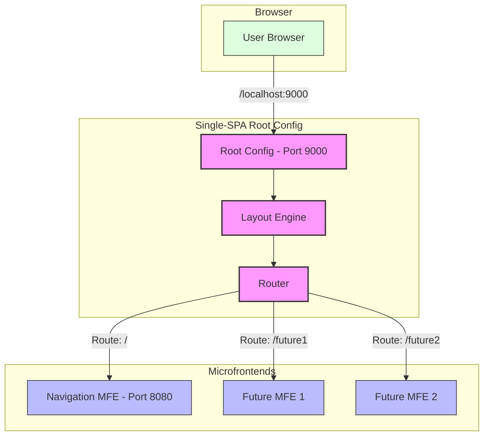
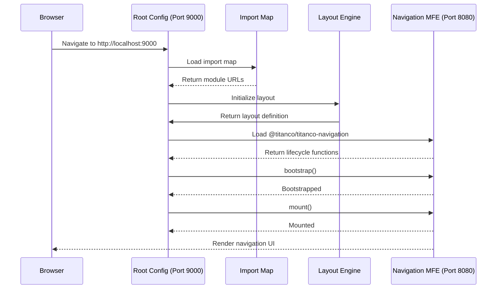
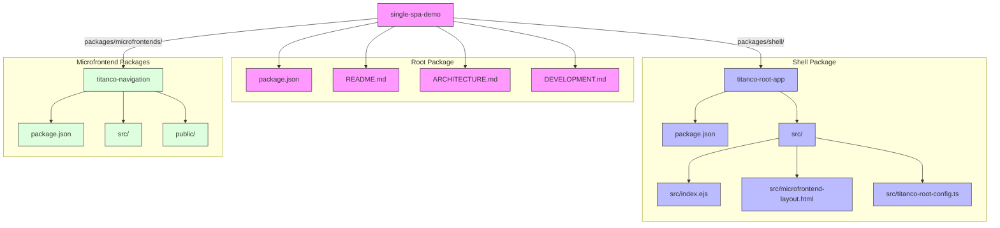

# Architecture Diagrams

This document contains architecture diagrams illustrating the microfrontend architecture and monorepo structure of this project.

## Microfrontend Architecture

The following diagram illustrates how the microfrontends are composed and interact within the single-spa framework:

## Runtime Flow

This diagram shows the runtime flow of how the application loads and renders microfrontends:

## Monorepo Structure

This diagram illustrates the monorepo structure and how the packages are organised:

